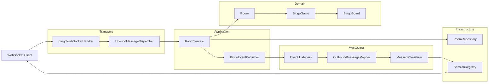
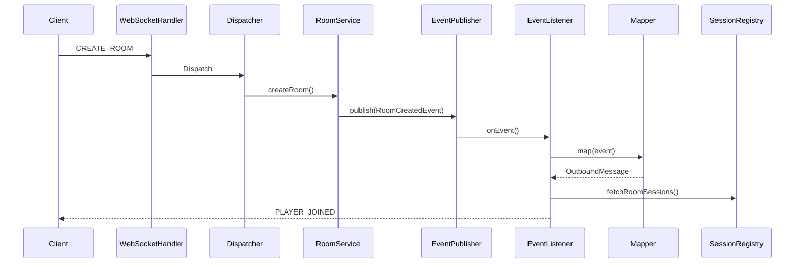

# 🎮 Bingo Multiplayer


A real-time multiplayer Bingo backend built with **Spring Boot** and **WebSockets**. The application follows an *
*event-driven architecture** where domain events are translated into WebSocket messages, keeping the business logic
independent from the transport layer.

---

## ✨ Features

- Real-time multiplayer gameplay
- Create and join Bingo rooms
- Turn-based gameplay
- Automatic board generation
- Server-side Bingo validation
- Event-driven messaging
- Unit tested components

---

## 🏗 Architecture



Incoming WebSocket commands are dispatched to the application layer. Business operations emit domain events instead of
directly communicating with clients. Event listeners map those events into outbound messages and broadcast them through
active WebSocket sessions.

---

## 📡 Event Flow



---

## 🎮 Gameplay

1. Connect to the WebSocket endpoint.
2. Create or join a room.
3. Wait for all players.
4. Host starts the game.
5. Every player receives a unique Bingo board.
6. Players call numbers in turn.
7. Server broadcasts every update.
8. Bingo claims are validated on the server.

---

## 📡 WebSocket Protocol

### Create Room

**Request**

```json
{
  "messageType": "CREATE_ROOM",
  "playerName": "Anirudh",
  "maxPlayers": 2
}
```

**Response**

```json
{
  "messageType": "PLAYER_JOINED",
  "roomId": "ABC123",
  "player": {
    "id": "player-1",
    "name": "Anirudh"
  }
}
```

### Join Room

**Request**

```json
{
  "messageType": "JOIN_ROOM",
  "roomId": "ABC123",
  "player": {
    "name": "John"
  }
}
```

**Response**

```json
{
  "messageType": "PLAYER_JOINED",
  "roomId": "ABC123",
  "player": {
    "id": "player-2",
    "name": "John"
  }
}
```

### Leave Room

**Request**

```json
{
  "messageType": "LEAVE_ROOM",
  "roomId": "ABC123"
}
```

**Response**

```json
{
  "messageType": "PLAYER_LEFT",
  "roomId": "ABC123",
  "playerName": "John"
}
```

If the last player leaves:

```json
{
  "messageType": "ROOM_CLOSED",
  "roomId": "ABC123"
}
```

### Start Game

**Request**

```json
{
  "messageType": "START_GAME",
  "roomId": "ABC123"
}
```

**Response**

```json
{
  "roomId": "ABC123",
  "room": {
    "bingoGame": {
      "finished": false,
      "id": "af3747c1-291d-4e74-852e-3c88da22ac6d",
      "players": [
        {
          "bingoBoard": {
            "grid": [
              [10, 24, 15, 8, 11],
              [7, 1, 9, 14, 5],
              [22, 18, 21, 12, 23],
              [19, 4, 6, 20, 13],
              [2, 25, 17, 3, 16]
            ]
          },
          "player": {
            "id": "c0cfe2f2-7973-4e80-8dfd-734c1aca88ba",
            "name": "Anirudh"
          }
        },
        {
          "bingoBoard": {
            "grid": [
              [18, 5, 8, 13, 20],
              [17, 16, 12, 7, 14],
              [11, 25, 24, 6, 15],
              [19, 21, 10, 4, 23],
              [1, 22, 2, 9, 3]
            ]
          },
          "player": {
            "id": "a0ea742b-e0cd-4b3e-b1b2-8a09e8155166",
            "name": "Anuj"
          }
        }
      ],
      "status": "IN_PROGRESS"
    },
    "id": "ABC123",
    "maxPlayers": 2,
    "players": [
      {
        "id": "c0cfe2f2-7973-4e80-8dfd-734c1aca88ba",
        "name": "Anirudh"
      },
      {
        "id": "a0ea742b-e0cd-4b3e-b1b2-8a09e8155166",
        "name": "Anuj"
      }
    ],
    "roomStatus": "IN_GAME"
  },
  "messageType": "GAME_STARTED"
}
```

### Call Number

**Request**

```json
{
  "messageType": "CALL_NUMBER",
  "roomId": "ABC123",
  "number": 17
}
```

**Responses**

```json
{
  "messageType": "NUMBER_CALLED",
  "roomId": "ABC123",
  "calledBy": "player-1",
  "number": 17
}
```

```json
{
  "messageType": "TURN_CHANGED",
  "roomId": "ABC123",
  "currentPlayerId": "player-2"
}
```

### Claim Bingo

**Request**

```json
{
  "messageType": "CLAIM_BINGO",
  "roomId": "ABC123"
}
```

**Responses**

```json
{
  "messageType": "BINGO_CLAIMED",
  "roomId": "ABC123",
  "playerId": "player-1",
  "accepted": true
}
```

```json
{
  "messageType": "GAME_WON",
  "roomId": "ABC123",
  "winnerPlayerId": "player-1"
}
```

```json
{
  "messageType": "GAME_ENDED",
  "roomId": "ABC123"
}
```

### Error

```json
{
  "messageType": "ERROR",
  "errorType": "ROOM_NOT_FOUND",
  "message": "Room ABC123 does not exist."
}
```

---

## 🧪 Testing

Unit tests cover:

- Domain model
- RoomService
- SessionRegistry
- OutboundMessageMapper
- Event listeners
- WebSocket messaging components

---

## ▶️ Running

```bash
mvn clean install
mvn spring-boot:run
```
