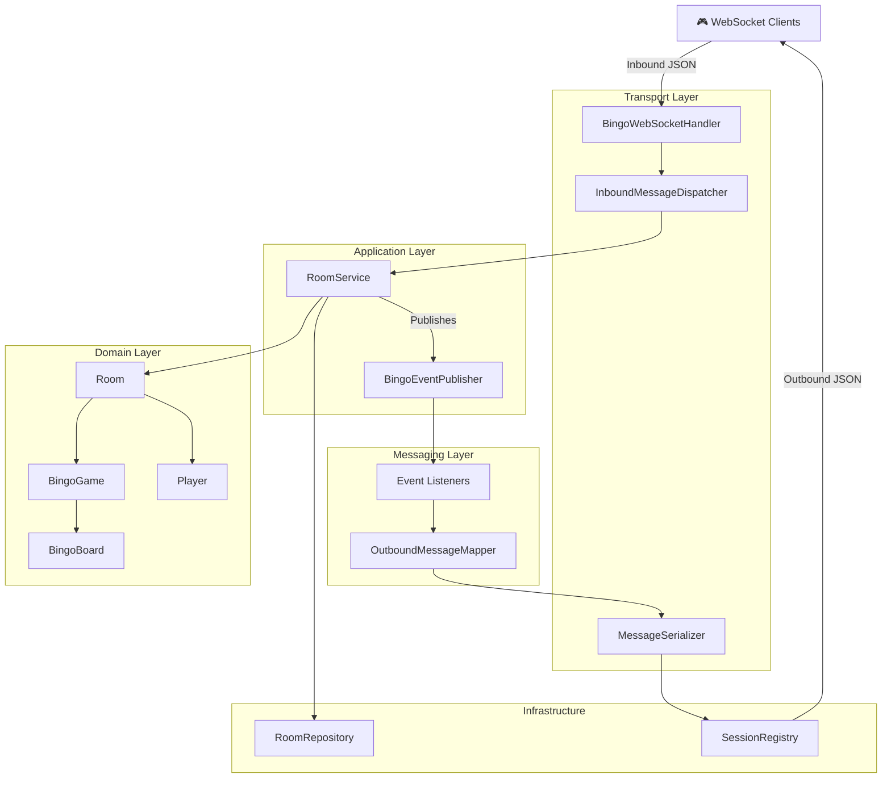
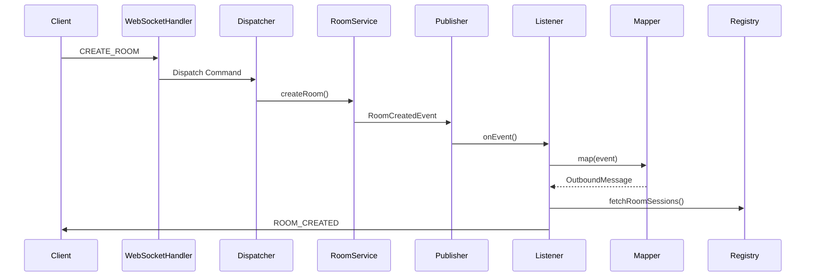

# 🎮 Bingo Multiplayer


A scalable, event-driven multiplayer Bingo backend built using **Spring Boot** and **WebSockets**.

## ✨ Features

- Create and join multiplayer Bingo rooms
- Real-time gameplay using WebSockets
- Turn-based number calling
- Automatic Bingo board generation
- Server-side Bingo validation
- Event-driven architecture
- Domain-driven design
- Comprehensive unit testing

## 🏗 Architecture



## 📡 Event Flow



## 🚀 Running

```bash
mvn clean install
mvn spring-boot:run
```

## 🧪 Testing

- Domain tests
- RoomService tests
- SessionRegistry tests
- OutboundMessageMapper tests
- Event Listener tests
- WebSocket tests
