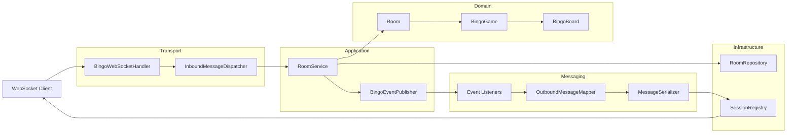
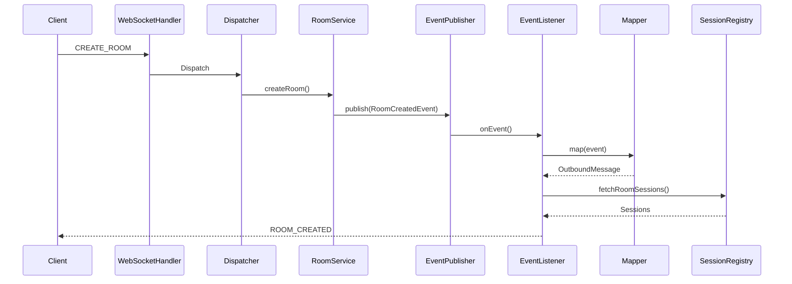

# 🎮 Bingo Multiplayer

A scalable, event-driven multiplayer Bingo backend built using **Spring Boot** and **WebSockets**.

## 🏗 Architecture

```mermaid
flowchart LR
    Client["WebSocket Client"]

    subgraph Transport
        Handler["BingoWebSocketHandler"]
        Dispatcher["InboundMessageDispatcher"]
    end

    subgraph Application
        Service["RoomService"]
        Publisher["BingoEventPublisher"]
    end

    subgraph Domain
        Room["Room"]
        Game["BingoGame"]
        Board["BingoBoard"]
    end

    subgraph Messaging
        Listeners["Event Listeners"]
        Mapper["OutboundMessageMapper"]
        Serializer["MessageSerializer"]
    end

    subgraph Infrastructure
        Repository["RoomRepository"]
        Registry["SessionRegistry"]
    end

    Client --> Handler
    Handler --> Dispatcher
    Dispatcher --> Service
    Service --> Room
    Room --> Game
    Game --> Board
    Service --> Repository
    Service --> Publisher
    Publisher --> Listeners
    Listeners --> Mapper
    Mapper --> Serializer
    Serializer --> Registry
    Registry --> Client
```

## 📡 Event Flow

```mermaid
sequenceDiagram
    participant C as Client
    participant W as WebSocketHandler
    participant D as Dispatcher
    participant S as RoomService
    participant P as EventPublisher
    participant L as EventListener
    participant M as Mapper
    participant R as SessionRegistry
    C ->> W: CREATE_ROOM
    W ->> D: Dispatch
    D ->> S: createRoom()
    S ->> P: publish(RoomCreatedEvent)
    P ->> L: onEvent()
    L ->> M: map(event)
    M -->> L: OutboundMessage
    L ->> R: fetchRoomSessions()
    R -->> L: Sessions
    L -->> C: ROOM_CREATED
```